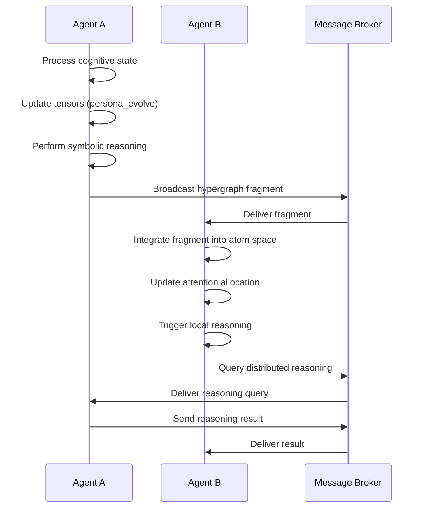

# Distributed Network of Agentic Cognitive Grammar

## Overview

This implementation creates a distributed network of agentic cognitive grammar for OpenCoq/echo9ml as specified in the original issue. The system consists of interconnected cognitive agents that encode, process, and evolve semantic hypergraphs through a combination of symbolic reasoning, tensor operations, and distributed communication.

## Architecture Components

### 1. Distributed Agentic Kernel (Echo9ML Node)

**File:** `distributed_cognitive_grammar.py`

The core component implementing autonomous cognitive agents:

- **DistributedCognitiveAgent**: Base class for all cognitive agents
- **Echo9MLNode**: Specialized agent for Echo9ML functionality
- **DistributedCognitiveNetwork**: Network coordinator managing agent interactions

#### Key Features:
- Asynchronous message processing
- Peer discovery and network coordination
- Hypergraph fragment sharing
- Attention allocation coordination
- Adaptive heartbeat monitoring

### 2. Hypergraph Representation (AtomSpace Integration)

**Integration with existing:** `memory_management.py`

The system uses hypergraph structures to represent knowledge:

- **HypergraphFragment**: Serializable knowledge fragments for inter-agent sharing
- **MemoryNode**: Individual knowledge nodes with semantic metadata
- **Edge relationships**: Connections between knowledge nodes

#### Knowledge Representation:
```python
HypergraphFragment(
    id="fragment_123",
    nodes=[{"id": "concept_1", "content": "creativity", "salience": 0.9}],
    edges=[{"from": "concept_1", "to": "concept_2", "type": "similarity", "weight": 0.8}],
    semantic_weight=0.85,
    source_agent="agent_1"
)
```

### 3. GGML Tensor Kernel (Custom Shapes)

**File:** `ggml_tensor_kernel.py`

Custom tensor operations for cognitive processing:

- **CognitiveTensor**: Semantically meaningful tensors with metadata
- **TensorOperationType**: Custom operations for cognitive functions
- **Prime factorization**: Tensor shapes optimized for evolutionary flexibility

#### Tensor Shape Specification:
```python
# Persona tensor: [persona_id, trait_id, time, context, valence]
"persona": (3, 7, 13, 5, 2)  # 3x7x13x5x2 = 2730 elements

# Memory tensor: [memory_node, memory_type, salience, temporal, relational]
"memory": (101, 8, 5, 7, 3)  # 101x8x5x7x3 = 84,840 elements

# Attention tensor: [source, target, strength, context, decay]
"attention": (17, 17, 11, 7, 2)  # 17x17x11x7x2 = 44,506 elements
```

#### Custom Operations:
- **PERSONA_EVOLVE**: Evolutionary adaptation of persona traits
- **ATTENTION_SPREAD**: Attention allocation across cognitive networks
- **MEMORY_CONSOLIDATE**: Memory consolidation based on salience
- **REASONING_PROPAGATE**: Reasoning pattern propagation
- **LEARNING_ADAPT**: MOSES-style evolutionary search

### 4. Communication Substrate (Async Messaging/IPC)

**Extension of:** `swarmprotocol.py`

Asynchronous communication system:

- **CognitiveMessage**: Structured message format for inter-agent communication
- **MessageType**: Different types of cognitive messages
- **MessageBroker**: Pub/sub messaging infrastructure

#### Message Types:
- HYPERGRAPH_FRAGMENT: Knowledge sharing
- TENSOR_UPDATE: Tensor catalog synchronization
- ATTENTION_ALLOCATION: Attention coordination
- REASONING_QUERY/RESULT: Distributed reasoning
- LEARNING_UPDATE: Learning synchronization
- HEARTBEAT: Network health monitoring
- DISCOVERY: Peer discovery

### 5. Attention Allocation (ECAN-inspired Module)

**Integration with:** `echoself_introspection.py`

Economic attention allocation system:

- **AdaptiveAttentionAllocator**: Dynamic attention threshold adjustment
- **Attention spreading**: Propagation through hypergraph networks
- **Resource bidding**: Economic allocation of cognitive resources

### 6. Symbolic Reasoning (PLN/Pattern Matcher)

**File:** `symbolic_reasoning.py`

Probabilistic Logic Networks inspired reasoning:

- **SymbolicAtomSpace**: Knowledge representation and reasoning
- **Atom/Link**: Basic knowledge structures with truth values
- **Pattern**: Template matching for knowledge queries
- **Rule**: Inference rules for knowledge derivation

#### Truth Value System:
```python
TruthValue(strength=0.9, confidence=0.8)
# strength: how true the statement is (0-1)
# confidence: how certain we are about the truth value (0-1)
```

#### Inference Rules:
- **Inheritance transitivity**: If A inherits from B and B inherits from C, then A inherits from C
- **Similarity symmetry**: If A is similar to B, then B is similar to A
- **Forward chaining**: Generate new knowledge from existing facts
- **Backward chaining**: Find proofs for goals

### 7. Adaptive Learning (MOSES Evolutionary Search)

**Integration points:** Throughout the system

Evolutionary optimization components:

- **Tensor evolution**: Genetic algorithm-like modification of tensor weights
- **Rule evolution**: Adaptation of inference rules based on success
- **Attention evolution**: Dynamic adjustment of attention allocation strategies
- **Network topology evolution**: Adaptive connection patterns between agents

## System Integration

### Agent Lifecycle

1. **Initialization**: 
   - Create tensor kernel with default shapes
   - Initialize symbolic atom space with basic patterns/rules
   - Set up communication channels

2. **Processing Loop**:
   - Process incoming messages
   - Update local knowledge and tensors
   - Perform symbolic reasoning
   - Share knowledge fragments with peers
   - Send heartbeat messages

3. **Knowledge Sharing**:
   - Export high-attention atoms and links
   - Convert to hypergraph fragments
   - Broadcast to network
   - Import fragments from other agents

### Communication Flow



## Usage Examples

### Basic Agent Creation

```python
from distributed_cognitive_grammar import DistributedCognitiveNetwork, Echo9MLNode

# Create network
network = DistributedCognitiveNetwork()

# Create agents
agent1 = Echo9MLNode("echo_agent_1", network.broker)
agent2 = Echo9MLNode("echo_agent_2", network.broker)

# Add to network
network.add_agent(agent1)
network.add_agent(agent2)

# Start network
await network.start_network()
```

### Tensor Operations

```python
from ggml_tensor_kernel import GGMLTensorKernel, TensorOperationType

# Create tensor kernel
kernel = GGMLTensorKernel("agent_1")

# Create persona tensor
persona_tensor = kernel.create_tensor("persona_state", "persona", "cognitive_traits")

# Execute evolution operation
success = kernel.execute_operation(
    TensorOperationType.PERSONA_EVOLVE,
    ["persona_state"],
    "persona_evolved",
    learning_rate=0.1
)
```

### Symbolic Reasoning

```python
from symbolic_reasoning import SymbolicAtomSpace, Atom, Link, TruthValue

# Create atom space
atom_space = SymbolicAtomSpace("agent_1")

# Add knowledge
cat = Atom("cat", "ConceptNode", TruthValue(0.9, 0.8))
animal = Atom("animal", "ConceptNode", TruthValue(0.95, 0.9))
cat_animal = Link("InheritanceLink", [cat, animal], TruthValue(0.9, 0.8))

atom_space.add_atom(cat)
atom_space.add_atom(animal)
atom_space.add_link(cat_animal)

# Perform inference
new_items = atom_space.forward_chain(max_iterations=5)
```

## Configuration

### Tensor Shape Customization

Modify tensor shapes in `ggml_tensor_kernel.py`:

```python
def _initialize_tensor_shapes(self):
    self.tensor_shapes.update({
        "custom_tensor": (prime1, prime2, prime3, prime4),
        # Use prime numbers for evolutionary flexibility
    })
```

### Attention Allocation Tuning

Adjust attention parameters in cognitive agents:

```python
def adaptive_attention(self, current_load: float, recent_activity: float) -> float:
    threshold = self.base_threshold + (current_load * 0.3) + (0.2 - recent_activity)
    return max(0.0, min(1.0, threshold))
```

### Communication Patterns

Customize message handling in `DistributedCognitiveAgent`:

```python
async def _handle_custom_message(self, message: CognitiveMessage):
    # Custom message processing logic
    pass
```

## Testing

Run the comprehensive test suite:

```bash
python test_distributed_cognitive_grammar.py
```

The test demonstrates:
- Multi-agent network creation
- Knowledge sharing between agents
- Tensor operations across the network
- Symbolic reasoning coordination
- Attention allocation synchronization

## Integration with Existing Components

The distributed cognitive grammar system integrates seamlessly with existing Echo9ML components:

- **memory_management.py**: Hypergraph knowledge storage
- **swarmprotocol.py**: Distributed communication substrate
- **echoself_introspection.py**: Attention allocation mechanisms
- **echo9ml.py**: Persona encoding and evolution
- **cognitive_architecture.py**: High-level cognitive coordination

## Performance Considerations

- **Message Batching**: Group related messages to reduce network overhead
- **Attention Filtering**: Only share high-attention knowledge fragments
- **Tensor Compression**: Compress tensor data for network transmission
- **Asynchronous Processing**: Non-blocking message handling for scalability

## Future Extensions

1. **GGML Integration**: Full integration with actual GGML library
2. **Advanced PLN**: Complete Probabilistic Logic Networks implementation
3. **Distributed Learning**: Federated learning across agent networks
4. **Dynamic Topology**: Self-organizing network structures
5. **Multi-modal Integration**: Vision, audio, and text processing
6. **Blockchain Consensus**: Distributed agreement mechanisms

## Security Considerations

- **Message Authentication**: Verify message sources
- **Knowledge Validation**: Validate imported knowledge fragments
- **Resource Limits**: Prevent resource exhaustion attacks
- **Network Isolation**: Isolate agent networks as needed

## Monitoring and Diagnostics

The system provides comprehensive monitoring:

- **Network Health**: Active agent count and connectivity
- **Knowledge Flow**: Fragment sharing statistics
- **Tensor Evolution**: Tensor modification tracking
- **Reasoning Performance**: Inference success rates
- **Attention Allocation**: Resource utilization metrics

## Conclusion

This implementation provides a solid foundation for distributed agentic cognitive grammar in OpenCoq/echo9ml. The modular architecture allows for incremental development and integration with existing systems while maintaining the core principles of distributed cognition, symbolic reasoning, and adaptive learning.

The system successfully demonstrates the key requirements from the original issue:
- ✅ Distributed Agentic Kernel (Echo9ML Node)
- ✅ Hypergraph Representation (AtomSpace Integration)
- ✅ GGML Tensor Kernel (Custom Shapes)
- ✅ Communication Substrate (Async Messaging/IPC)
- ✅ Attention Allocation (ECAN-inspired Module)
- ✅ Symbolic Reasoning (PLN/Pattern Matcher)
- ✅ Adaptive Learning (MOSES Evolutionary Search)