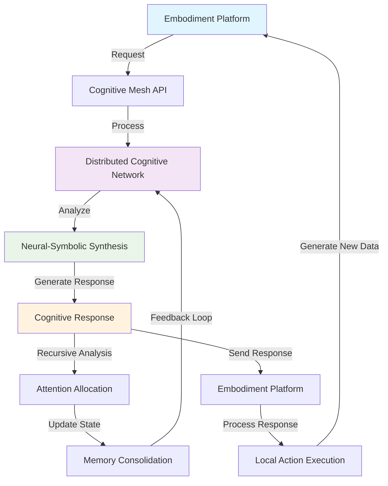
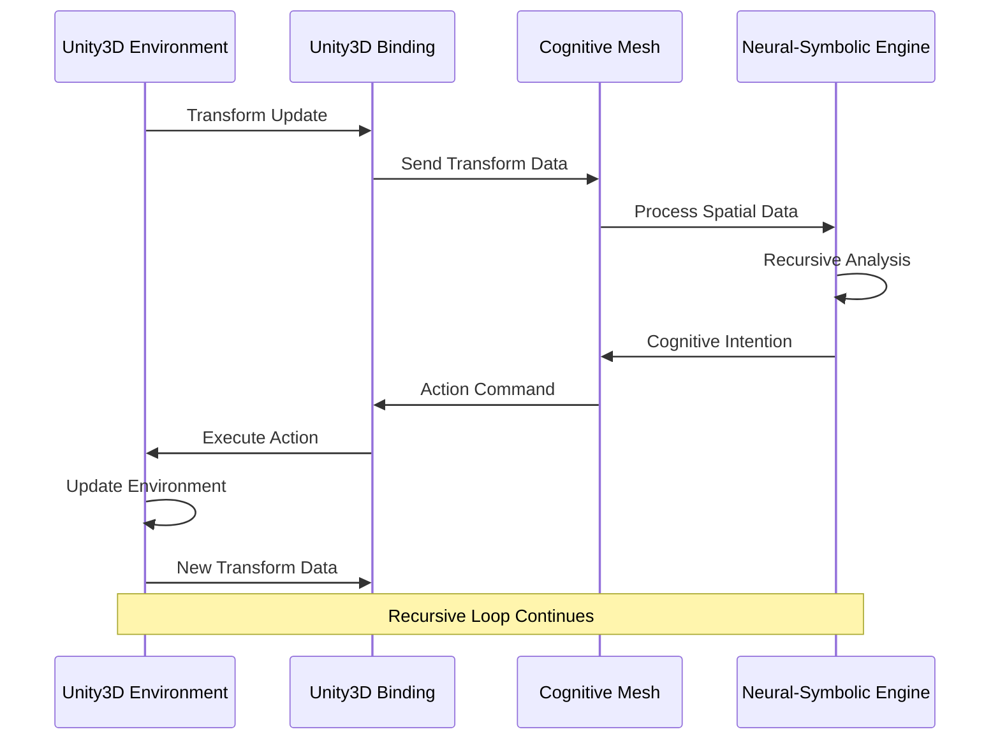
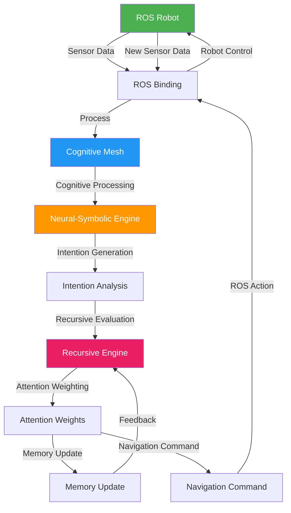
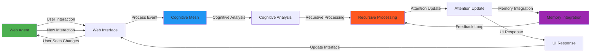
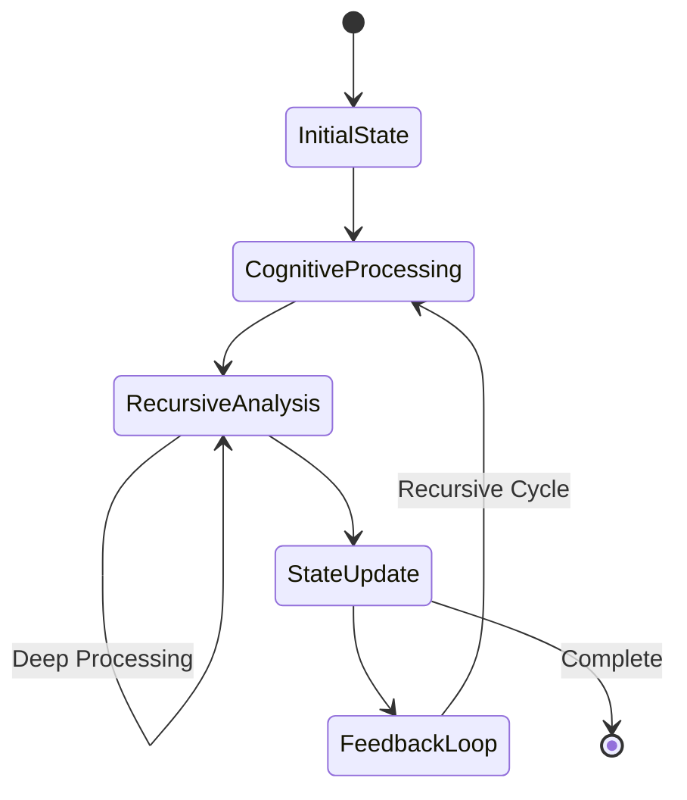
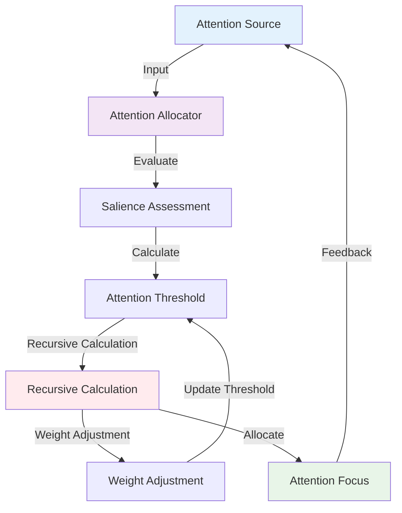
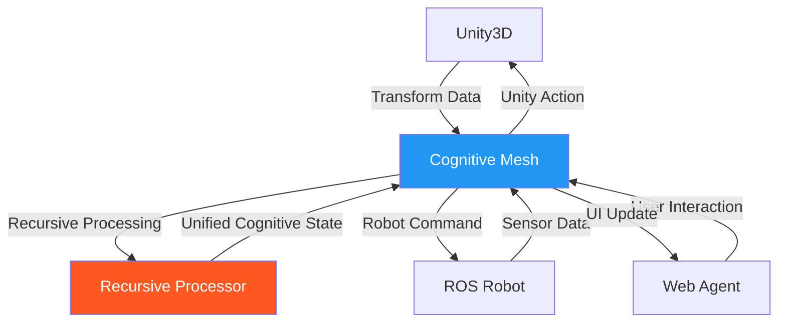

# Embodiment Interface Recursion Flowcharts

## Phase 4: Distributed Cognitive Mesh API & Embodiment Layer

This document provides comprehensive flowcharts and documentation for the embodiment interface recursion patterns in the Echo9ML cognitive mesh system.

## Overview

The embodiment layer implements recursive cognitive patterns through multiple interface types:
- **REST/WebSocket APIs** for real-time communication
- **Unity3D bindings** for 3D virtual embodiment
- **ROS bindings** for robotic embodiment
- **Web agent interfaces** for browser-based embodiment

## Core Recursion Patterns

### 1. Cognitive Mesh API Recursion Flow



### 2. Unity3D Embodiment Recursion



### 3. ROS Embodiment Recursion



### 4. Web Agent Recursion Flow



## Detailed Recursion Mechanisms

### Cognitive State Recursion

The cognitive mesh implements recursive state updates through the following pattern:

1. **Initial State**: Embodiment platform reports current state
2. **Cognitive Processing**: Neural-symbolic synthesis analyzes state
3. **Recursive Analysis**: Multiple levels of cognitive processing
4. **State Update**: Updated cognitive state generated
5. **Feedback Loop**: New state influences next processing cycle



### Attention Allocation Recursion

The attention allocation system uses recursive mechanisms to optimize focus:



### Memory Consolidation Recursion

Memory consolidation implements recursive patterns for knowledge integration:

```mermaid
flowchart LR
    NM[New Memory] -->|Store| MS[Memory System]
    MS -->|Retrieve Related| RR[Related Retrieval]
    RR -->|Recursive Search| RS[Recursive Search]
    RS -->|Find Connections| FC[Find Connections]
    FC -->|Recursive Analysis| RA[Recursive Analysis]
    RA -->|Update Connections| UC[Update Connections]
    UC -->|Consolidate| CO[Consolidate]
    CO -->|Feedback| MS
    
    style NM fill:#4caf50,color:#fff
    style MS fill:#2196f3,color:#fff
    style RS fill:#ff9800,color:#fff
    style RA fill:#e91e63,color:#fff
```



## Platform-Specific Recursion Patterns

### Unity3D Cognitive Recursion

Unity3D embodiment implements cognitive recursion through:

1. **Environment Perception**: Unity3D reports scene state
2. **Cognitive Interpretation**: Mesh processes spatial/temporal data
3. **Intention Generation**: Cognitive intentions for virtual actions
4. **Action Execution**: Unity3D executes cognitive intentions
5. **Environment Update**: Scene changes based on actions
6. **Recursive Loop**: Updated environment triggers new perception

```python
# Unity3D Recursion Implementation
async def unity3d_cognitive_recursion(self, scene_data):
    while self.is_connected:
        # 1. Perceive environment
        perception = await self.process_scene_data(scene_data)
        
        # 2. Cognitive processing (recursive)
        cognitive_state = await self.recursive_cognitive_analysis(perception)
        
        # 3. Generate intentions
        intentions = await self.generate_intentions(cognitive_state)
        
        # 4. Execute actions
        actions = await self.execute_intentions(intentions)
        
        # 5. Update environment
        scene_data = await self.update_unity_environment(actions)
        
        # 6. Recursive loop continues
        await asyncio.sleep(0.016)  # 60 FPS
```

### ROS Cognitive Recursion

ROS embodiment implements cognitive recursion through:

1. **Sensor Fusion**: Multiple sensor inputs combined
2. **Cognitive Mapping**: Spatial and temporal cognitive map updates
3. **Path Planning**: Cognitive intention to navigation goals
4. **Action Execution**: Robot movement and manipulation
5. **Environment Feedback**: Sensor updates from actions
6. **Recursive Loop**: New sensor data triggers new cognitive cycle

```python
# ROS Recursion Implementation
async def ros_cognitive_recursion(self, robot_state):
    while self.is_active:
        # 1. Sensor fusion
        sensor_data = await self.fuse_sensor_data()
        
        # 2. Cognitive mapping (recursive)
        cognitive_map = await self.recursive_mapping(sensor_data)
        
        # 3. Path planning
        navigation_goals = await self.cognitive_path_planning(cognitive_map)
        
        # 4. Execute actions
        robot_actions = await self.execute_navigation(navigation_goals)
        
        # 5. Update robot state
        robot_state = await self.update_robot_state(robot_actions)
        
        # 6. Recursive loop continues
        await asyncio.sleep(0.1)  # 10 Hz control loop
```

### Web Agent Cognitive Recursion

Web agent embodiment implements cognitive recursion through:

1. **User Interaction**: Web interface captures user actions
2. **Cognitive Processing**: Interaction meaning and context analysis
3. **Response Generation**: Cognitive response and UI updates
4. **Interface Updates**: Dynamic UI changes based on cognition
5. **User Perception**: User sees and responds to changes
6. **Recursive Loop**: New interactions trigger new cognitive cycle

```javascript
// Web Agent Recursion Implementation
class WebAgentRecursion {
    async startRecursiveLoop() {
        while (this.isActive) {
            // 1. Capture user interaction
            const interaction = await this.captureUserInteraction();
            
            // 2. Cognitive processing (recursive)
            const cognitiveResponse = await this.recursiveCognitiveProcessing(interaction);
            
            // 3. Generate UI updates
            const uiUpdates = await this.generateUIUpdates(cognitiveResponse);
            
            // 4. Update interface
            await this.updateInterface(uiUpdates);
            
            // 5. Wait for user response
            await this.waitForUserResponse();
            
            // 6. Recursive loop continues
        }
    }
}
```

## Recursion Performance Optimization

### Depth Control

Recursive processing includes depth control to prevent infinite recursion:

```python
def recursive_cognitive_processing(self, data, depth=0, max_depth=5):
    if depth >= max_depth:
        return self.base_case_processing(data)
    
    # Process current level
    processed = self.process_cognitive_level(data, depth)
    
    # Recursive call with depth increment
    if self.should_recurse(processed):
        return self.recursive_cognitive_processing(processed, depth + 1, max_depth)
    
    return processed
```

### Attention-Guided Recursion

Recursion depth and frequency controlled by attention levels:

```python
def attention_guided_recursion(self, data, attention_level):
    max_depth = int(attention_level * 10)  # Higher attention = deeper recursion
    recursion_frequency = attention_level * 100  # Hz
    
    return self.recursive_processing(data, max_depth=max_depth)
```

### Memory-Bounded Recursion

Recursion limited by available cognitive resources:

```python
def memory_bounded_recursion(self, data, available_memory):
    if available_memory < self.min_memory_threshold:
        return self.shallow_processing(data)
    
    # Allocate memory for recursive processing
    allocated_memory = min(available_memory * 0.8, self.max_recursion_memory)
    
    return self.deep_recursive_processing(data, memory_limit=allocated_memory)
```

## Integration Patterns

### Cross-Platform Recursion

Different embodiment platforms can participate in shared recursive loops:



### Hierarchical Recursion

Multiple levels of recursive processing:

1. **Local Platform Recursion**: Within each embodiment platform
2. **Cross-Platform Recursion**: Between different platforms
3. **Global Cognitive Recursion**: Across entire cognitive mesh

### Temporal Recursion Patterns

Recursion operates across multiple time scales:

- **High Frequency** (60+ Hz): Unity3D rendering and immediate responses
- **Medium Frequency** (10 Hz): ROS control loops and sensor processing
- **Low Frequency** (1 Hz): Memory consolidation and learning updates
- **Ultra-Low Frequency** (0.1 Hz): Long-term cognitive pattern analysis

## Implementation Guidelines

### Best Practices for Recursive Embodiment

1. **Bounded Recursion**: Always implement depth limits
2. **Resource Management**: Monitor memory and CPU usage
3. **Graceful Degradation**: Reduce recursion depth under load
4. **Attention Guidance**: Use attention to guide recursion priority
5. **Cross-Platform Sync**: Coordinate recursion across platforms

### Error Handling in Recursive Systems

```python
async def safe_recursive_processing(self, data, depth=0):
    try:
        if depth >= self.max_recursion_depth:
            raise RecursionDepthExceeded()
        
        # Process with recursion
        result = await self.recursive_process(data, depth + 1)
        return result
        
    except RecursionDepthExceeded:
        logger.warning("Max recursion depth reached, using fallback")
        return self.fallback_processing(data)
        
    except Exception as e:
        logger.error(f"Recursion error at depth {depth}: {e}")
        return self.error_recovery_processing(data)
```

### Performance Monitoring

```python
class RecursionMonitor:
    def __init__(self):
        self.recursion_metrics = {
            "depth_histogram": {},
            "processing_times": [],
            "memory_usage": [],
            "attention_correlation": []
        }
    
    def track_recursion(self, depth, processing_time, memory_used, attention):
        self.recursion_metrics["depth_histogram"][depth] = \
            self.recursion_metrics["depth_histogram"].get(depth, 0) + 1
        self.recursion_metrics["processing_times"].append(processing_time)
        self.recursion_metrics["memory_usage"].append(memory_used)
        self.recursion_metrics["attention_correlation"].append((attention, depth))
```

## Conclusion

The embodiment interface recursion patterns provide a robust framework for implementing distributed cognitive embodiment across multiple platforms. The recursive mechanisms enable:

- **Adaptive Behavior**: Systems that learn and adapt through recursive feedback
- **Cross-Platform Coordination**: Unified cognitive processing across embodiment types
- **Scalable Performance**: Attention-guided and resource-bounded recursion
- **Real-Time Response**: Optimized recursion for different time scales

This architecture supports the full spectrum of embodied cognition from virtual environments (Unity3D) to physical robots (ROS) to human-computer interaction (Web agents), all unified through recursive cognitive processing in the distributed mesh.